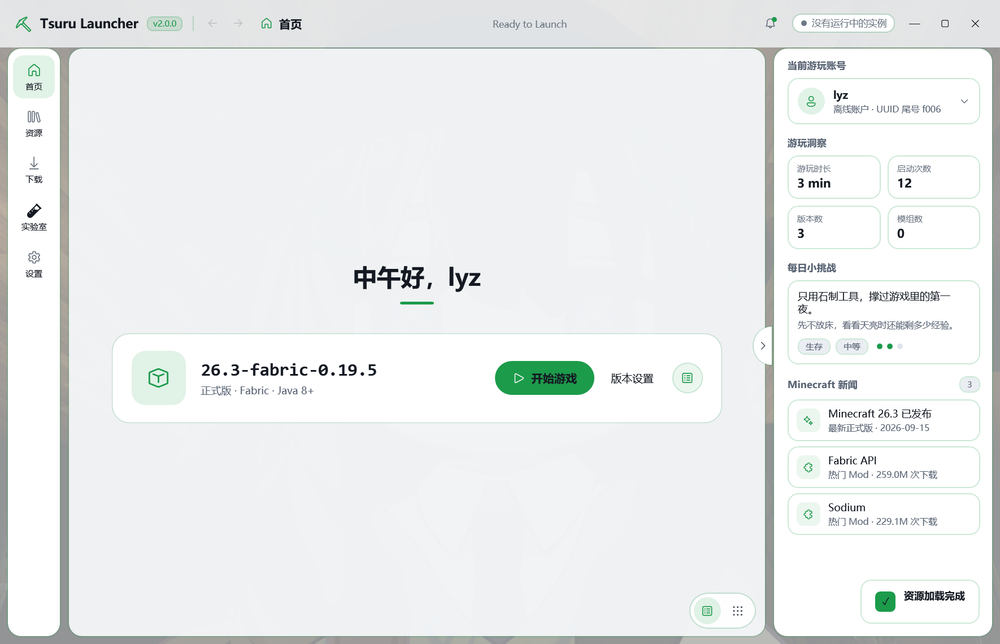
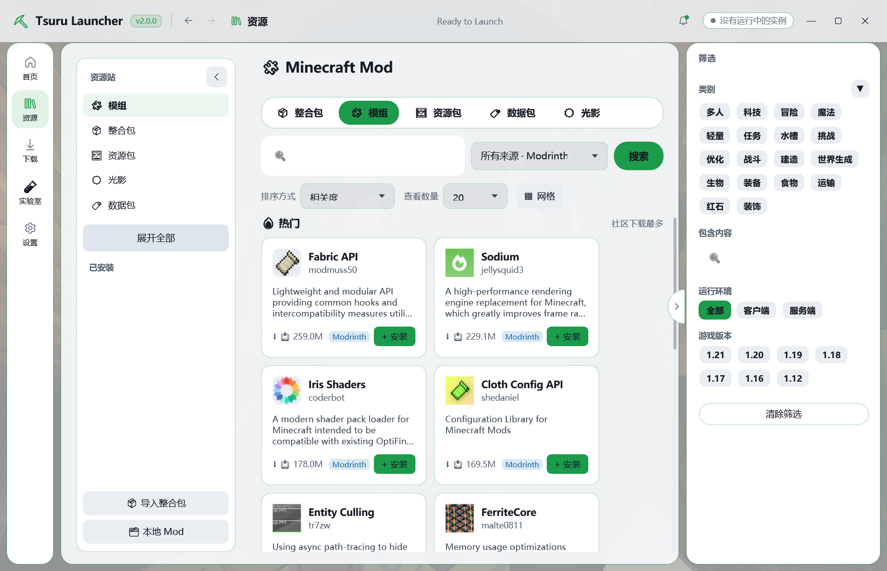
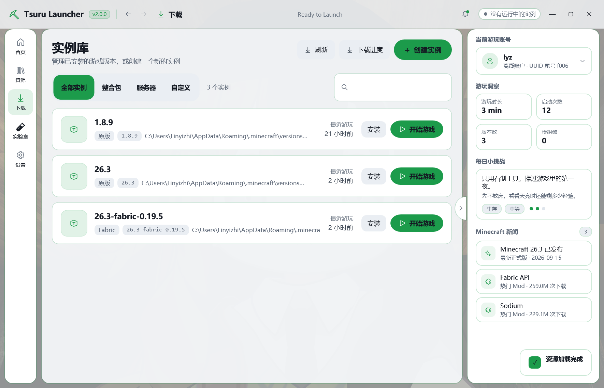
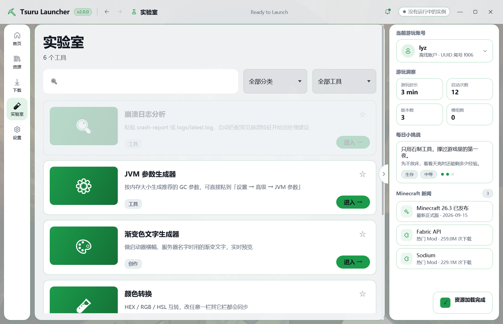
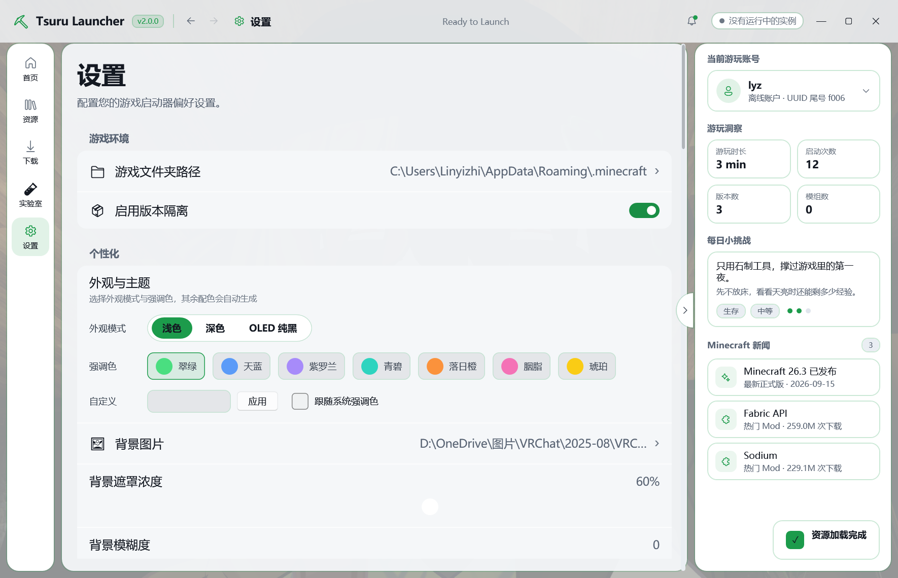

<div align="center">

# Tsuru Launcher

**一个基于 .NET 8 + WPF 的现代化 Minecraft 启动器**

游戏版本管理 · Modrinth / CurseForge 资源下载 · 微软账号登录 · iOS26 毛玻璃界面

[](https://github.com/LinYiZhi-wp/TsuruLauncher/releases/latest)
[](https://dotnet.microsoft.com/download/dotnet/8.0)
[](https://github.com/LinYiZhi-wp/TsuruLauncher/releases/latest)
[](https://github.com/LinYiZhi-wp/TsuruLauncher/releases)

[界面预览](#界面预览) · [功能特性](#功能特性) · [下载安装](#下载安装) · [构建运行](#构建运行) · [版本历史](#版本历史)

</div>

---

> [!NOTE]
> 项目原名 **LYZL Minecraft Launcher**，自 **v2.0** 起更名为 **Tsuru Launcher**。
> 从 v1.x 升级请先看 [从 v1.x 迁移](#从-v1x-迁移)。

## 简介

Tsuru Launcher 是一个面向 Windows 的 Minecraft 启动器。它把「装版本 → 装 Mod → 开游戏」这条链路收在一处：既能管理多个游戏实例与 Mod Loader，也能直接浏览并安装 Modrinth / CurseForge 上的模组、整合包、资源包、光影和数据包。

界面走 iOS26 风格的毛玻璃设计，内置一套完整的动效体系（与 [Axolotl Launcher](https://github.com/axolotl-launcher) 同源的缓动曲线），支持浅色 / 深色 / OLED 纯黑三种外观与 8 种强调色。

## 界面预览

### 首页

问候语、当前实例一键启动、游玩洞察（时长 / 启动次数 / 版本数 / 模组数）、每日小挑战、Minecraft 新闻与最近的世界。



### 资源站

集成 Modrinth 与 CurseForge，按「整合包 / 模组 / 资源包 / 数据包 / 光影」分类浏览，支持关键词搜索、相关度 / 下载量 / 最近更新排序，以及类别、运行环境、游戏版本多维筛选。左侧栏同时管理已安装的 Mod。



### 实例库

按「全部实例 / 整合包 / 服务器 / 自定义」分类管理已安装的游戏版本，显示最近游玩时间与安装路径，可一键启动或补充安装。



### 实验室

内置一组离线小工具：崩溃日志分析、JVM 参数生成器、渐变色文字生成器、颜色转换。全部本地计算，不上传任何内容。



### 设置

游戏文件夹路径与版本隔离开关、浅色 / 深色 / OLED 纯黑三种外观模式、8 种强调色与自定义取色、背景图片与遮罩浓度 / 模糊度调节。



## 功能特性

### 游戏与实例管理

- 多实例管理，支持「全部实例 / 整合包 / 服务器 / 自定义」分类
- **版本隔离**：每个实例独立的 `mods` / `config` / `saves`，互不干扰
- Mod Loader 安装：**Vanilla / Fabric / Forge / OptiFine**
- 每个实例独立配置 JVM 参数、最大 / 最小内存、Java 路径
- 实例导出，便于备份与分享
- 自动检测并管理本机 Java 运行环境

### 资源下载

- 集成 **Modrinth** 与 **CurseForge** 双源，可切换来源
- 五类资源：**整合包 / 模组 / 资源包 / 数据包 / 光影**
- 关键词搜索 + 相关度 / 下载量 / 最近更新排序
- 多维筛选：类别、包含内容、运行环境（全部 / 客户端 / 服务端）、游戏版本
- 资源详情页含 **描述 / 版本 / 图库** 三个标签：
  - 版本表格支持平台、游戏版本、更新通道（正式版 / 测试版 / 内测版）筛选
  - 支持按新旧排序与分页
  - 每行一键下载，可选择安装到哪个实例或仅下载
- 自动解析并下载依赖项
- 支持导入本地整合包与本地 Mod

### 账号

- **微软账号**登录（OAuth 设备码流程）
- **离线账号**
- **外置登录**（Authlib-Injector / Yggdrasil），支持自定义验证服务器

### 下载管理

- 多任务下载队列，实时进度与速度显示
- 断点续传
- 失败重试与任务日志

### 界面与交互

- iOS26 风格毛玻璃界面，统一圆角与配色系统
- **浅色 / 深色 / OLED 纯黑**三种外观模式
- 8 种强调色 + 自定义取色 + 跟随系统
- 自定义背景图片，可调遮罩浓度与模糊度
- 完整的动效体系：页面转场、列表错峰入场、侧栏折叠、滑动指示块
- 统一弹框组件（`iOS26Dialog`），替代系统 MessageBox
- 通知 Toast、骨架屏加载
- 支持 **简体中文 / English** 切换

### 其他

- 崩溃日志分析器
- 游戏启动日志实时查看
- 启动器布局自定义（侧栏宽度、紧凑模式等）

## 技术栈

| 技术 | 版本 | 用途 |
|------|------|------|
| [.NET](https://dotnet.microsoft.com/) | 8.0 | 运行时框架 |
| [WPF](https://learn.microsoft.com/dotnet/desktop/wpf/) | — | 桌面 UI 框架 |
| [WPF-UI](https://github.com/lepoco/wpfui) | 3.0.4 | 现代化 WPF 控件库 |
| [CommunityToolkit.Mvvm](https://github.com/CommunityToolkit/dotnet) | 8.2.2 | MVVM 架构 |
| [Newtonsoft.Json](https://www.newtonsoft.com/json) | 13.0.3 | JSON 序列化 |
| [SharpZipLib](https://github.com/icsharpcode/SharpZipLib) | 1.4.2 | 压缩文件处理 |
| [WebView2](https://learn.microsoft.com/microsoft-edge/webview2/) | 1.0.3719.77 | 内嵌网页组件 |
| [System.Management](https://www.nuget.org/packages/System.Management) | 8.0.0 | 硬件信息读取 |

## 项目结构

```
TsuruLauncher/
├── App.xaml / App.xaml.cs        # 应用入口、主题初始化、全局异常
├── MainWindow.xaml(.cs)          # 主窗口：导航栏 / 标题栏 / 信息面板
├── Assets/                       # 静态资源（背景图等）
├── Controls/                     # 自定义控件
│   ├── iOS26Dialog.cs            #   统一弹框（毛玻璃卡片）
│   ├── ModInstallPickerDialog.cs #   安装实例选择弹框
│   ├── MultiSelectFilter.xaml    #   多选筛选下拉
│   ├── NotificationToast.xaml    #   通知 Toast
│   ├── ResourceDetailSidePanel   #   资源详情右侧信息栏
│   ├── ResourcesFilterPanel      #   资源页筛选栏
│   └── VirtualizingWrapPanel.cs  #   虚拟化瀑布流面板
├── Converters/                   # 数据绑定转换器
├── Models/                       # 数据模型
│   └── Ecosystem/                #   模组生态模型（ModProject / ModFile / ResourceDetail）
├── Resources/Languages/          # 多语言资源（zh-CN / en-US）
├── Services/                     # 业务服务层
│   ├── Animation/                #   动效体系（缓动曲线、页面转场、性能诊断）
│   ├── Ecosystem/                #   模组生态服务
│   │   ├── ContentSourceService  #     双源抽象（Modrinth / CurseForge）
│   │   ├── ModrinthService       #     Modrinth API
│   │   ├── CurseForgeService     #     CurseForge API
│   │   ├── ModLoaderService      #     Fabric / Forge / OptiFine 安装
│   │   └── ModpackService        #     整合包解析
│   └── Network/                  #   网络服务
│       ├── DownloadManagerService#     下载队列管理
│       ├── VersionManifestService#     Mojang 版本清单
│       └── DownloadService       #     通用下载
├── Styles/                       # 样式资源（配色、iOS26 组件、玻璃滚动条）
├── Utilities/                    # 工具类（日志、主题画刷）
├── ViewModels/                   # 视图模型（MVVM）
└── Views/                        # 视图页面
    ├── HomePage                  #   首页
    ├── ResourcesPage             #   资源站
    ├── ResourceDetailPage        #   资源详情
    ├── DownloadPage              #   实例库
    ├── LabPage                   #   实验室
    ├── SettingsPage              #   设置
    ├── VersionSelectorPage       #   版本选择
    ├── VersionSettingsPage       #   实例设置
    ├── LoaderSelectionPage       #   Mod Loader 选择
    ├── DownloadManagerPage       #   下载管理
    └── Dialogs/                  #   对话框
```

## 下载安装

前往 [**Releases**](https://github.com/LinYiZhi-wp/TsuruLauncher/releases/latest) 下载：

| 文件 | 说明 |
|------|------|
| `Tsuru-Launcher-Setup-v2.0.0.exe` | **安装程序**（推荐）：带安装向导，自动创建开始菜单与桌面快捷方式，支持卸载 |
| `Tsuru-v2.0.0.zip` | **便携版**：解压后直接运行 `TsuruLauncher.exe`，无需安装 |

### 运行要求

- **Windows 10 或更高版本**（64 位）
- [**.NET 8 桌面运行时（Desktop Runtime）**](https://dotnet.microsoft.com/download/dotnet/8.0)

> 安装程序会自动检测 .NET 8 桌面运行时；未安装时会弹窗提示并给出下载链接（不阻断安装，你可以稍后再装）。

## 构建运行

### 环境要求

- [.NET 8 SDK](https://dotnet.microsoft.com/download/dotnet/8.0)
- Windows 10 或更高版本
- （可选）Visual Studio 2022 / JetBrains Rider

### 克隆与构建

```bash
git clone https://github.com/LinYiZhi-wp/TsuruLauncher.git
cd TsuruLauncher

dotnet build
```

### 运行

```bash
dotnet run --project TsuruLauncher
```

### 调试入口

应用支持通过命令行参数直接进入指定页面，方便调试：

```bash
TsuruLauncher.exe --page home             # 首页
TsuruLauncher.exe --page resources        # 资源站
TsuruLauncher.exe --page resource-detail  # 资源详情（使用内置假数据）
TsuruLauncher.exe --page download         # 实例库
TsuruLauncher.exe --page lab              # 实验室
TsuruLauncher.exe --page settings         # 设置

# 截图后自动退出（配合 --page 使用）
TsuruLauncher.exe --page home --screenshot out.png --screenshot-delay 8000
```

### 打包安装程序

仓库自带 Inno Setup 脚本 `Setup/Tsuru.iss`：

```bash
# 1. 发布（注意必须加 --no-restore）
dotnet publish TsuruLauncher/TsuruLauncher.csproj -c Release -o publish --no-restore -p:DebugType=none

# 2. 编译安装包
cd Setup
"C:\Program Files (x86)\Inno Setup 6\ISCC.exe" Tsuru.iss
```

产物输出到 `Setup/Output/Tsuru-Launcher-Setup-v2.0.0.exe`。

> [!IMPORTANT]
> `dotnet publish` 必须带 `--no-restore`。部分环境下 NuGet 源配置异常会导致
> `error : Value cannot be null. (Parameter 'path1')`，跳过 restore 即可正常发布
> （`dotnet build` 本身不需要 restore）。

## 版本历史

### v2.0.0 — 更名发布

**更名**
- 项目由 **LYZL Minecraft Launcher** 更名为 **Tsuru Launcher**
- 项目目录 `GeminiLauncher/` → `TsuruLauncher/`
- 程序集 / 产品名 / 安装目录 / 快捷方式全部更新
- 实例配置文件 `lyzl_profile.json` → `tsuru_profile.json`（自动迁移，见下）
- 仓库 `.gitignore` 改为根目录白名单，只保留项目本体

**资源详情页重构**
- 新增 **描述 / 版本 / 图库** 三个标签页
- 去掉嵌套滚动条，整页只保留一个
- 修复版本列表「没有找到匹配的版本」：不再把当前实例的游戏版本强制加入筛选条件
- 版本行的下载按钮现在会真正触发下载流程
- 移除底部冗余的「下载安装」卡片，下载统一走版本行；「同时下载依赖项」移入实例选择弹框
- 图库图片改为异步加载，修复部分图片空白
- 标签切换加入淡入 + 上推动画

**统一弹框**
- 全部 21 处系统 MessageBox 替换为 `iOS26Dialog`
- 修复弹框按钮点击无响应
- 修复确认框缺少「取消」按钮

**其他修复**
- 修复下拉框显示类型名而不是文件名

### v1.2.0 / v1.3.0

- 优化下载管理服务
- 增强 ModLoader 与 Modpack 服务
- 改进动画过渡效果
- 更新版本设置页面与主页逻辑

### v1.1.0

- UI 全面升级：统一颜色系统、毛玻璃效果、标准化圆角
- 修复 UI 崩溃问题

## 从 v1.x 迁移

| 项目 | v1.x | v2.0 |
|------|------|------|
| 产品名 | LYZL Minecraft Launcher | Tsuru Launcher |
| 主程序 | `LYZL.exe` | `TsuruLauncher.exe` |
| 实例配置 | `lyzl_profile.json` | `tsuru_profile.json` |
| 安装目录 | `LYZL Minecraft Launcher` | `Tsuru Launcher` |

**配置文件会自动迁移**：读取时若只有旧文件 `lyzl_profile.json`，仍会正常加载；下次保存时写入新文件名并删除旧文件。你每个实例的 JVM 参数与内存设置不会丢失。

> [!WARNING]
> 由于产品改名，v2.0 的安装包使用**新的 AppId**，不会覆盖旧的 LYZL 安装。
> 建议先在「控制面板 → 程序和功能」中卸载旧版本。

## 数据来源

- [Modrinth](https://modrinth.com/) — 模组资源 API
- [CurseForge](https://www.curseforge.com/) — 模组资源 API
- [Mojang](https://www.minecraft.net/) — Minecraft 版本清单与资源
- [Microsoft](https://www.microsoft.com/) — 微软账号认证
- [BMCLAPI](https://bmclapi2.bangbang93.com/) — 国内下载镜像

## 鸣谢

- [WPF-UI](https://github.com/lepoco/wpfui) — 现代化 WPF 控件库
- [CommunityToolkit.Mvvm](https://github.com/CommunityToolkit/dotnet) — MVVM 工具包
- [Axolotl Launcher](https://github.com/axolotl-launcher) — 动效曲线与界面风格参考

## 许可

本项目暂未添加开源许可证，保留所有权利。
