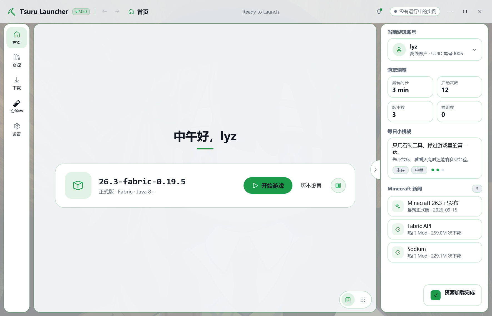
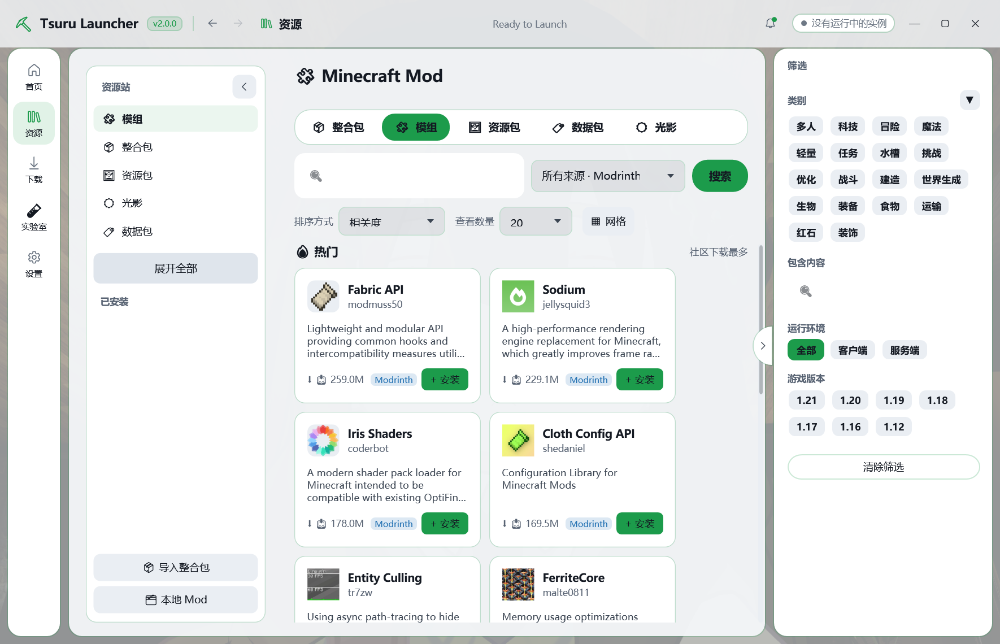
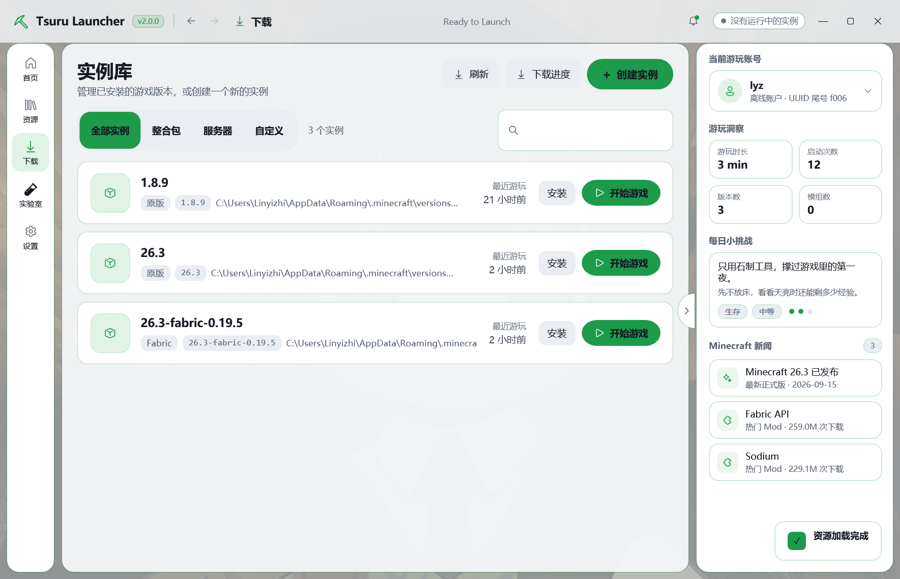
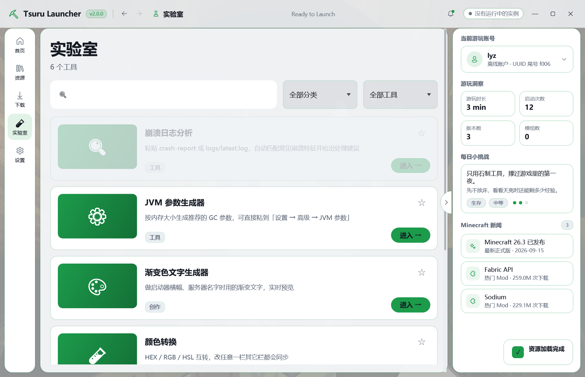
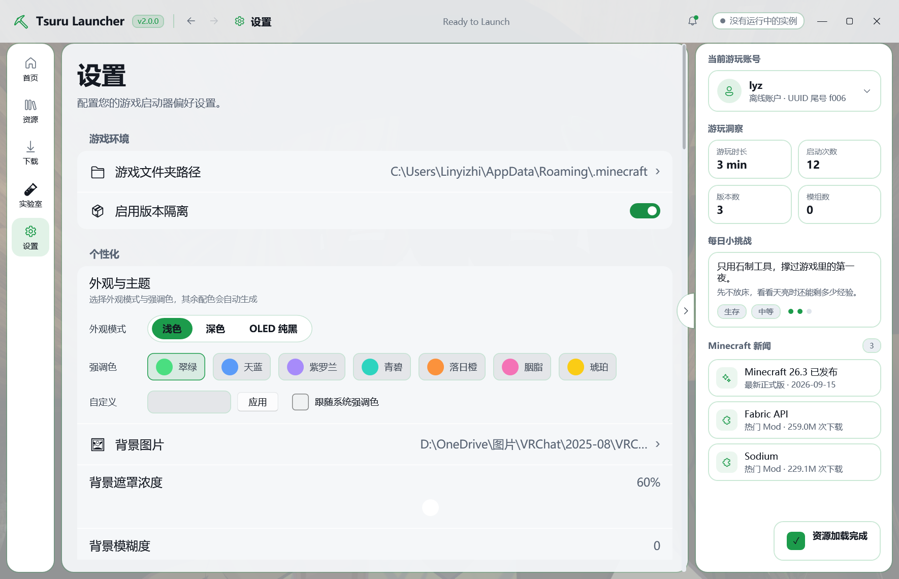

<div align="center">

# Tsuru Launcher

**把界面做认真的 Minecraft 启动器**

Windows 10+ · .NET 8 · WPF

[](https://github.com/LinYiZhi-wp/TsuruLauncher/releases/latest)
[](https://github.com/LinYiZhi-wp/TsuruLauncher/releases)
[](https://github.com/LinYiZhi-wp/TsuruLauncher/releases/latest)
[](https://dotnet.microsoft.com/download/dotnet/8.0)
[](LICENSE)

[下载](#下载) · [界面](#界面) · [设计](#设计) · [从源码构建](#从源码构建) · [版本历史](#版本历史)

</div>

---

## 这是什么

一个 Windows 上的 Minecraft 启动器。

多实例、版本隔离、Fabric / Forge / OptiFine、Modrinth 与 CurseForge 双源下载、
微软 / 离线 / 外置登录 —— 该有的都有，但这里不打算把它们当卖点再列一遍。

真正花力气的是**手感**：这个启动器里没有「啪」一下的变化。页签、卡片选中、悬停、
按下、展开收起、页面切换，全部走过渡 —— v2.1.3 一次性清掉了 40 处硬切。
外观走 iOS26 毛玻璃，动效曲线与 [Axolotl Launcher](https://github.com/axolotl-launcher) 同源。

> [!NOTE]
> 项目原名 **LYZL Minecraft Launcher**，v2.0 起更名为 **Tsuru Launcher**。
> 从 v1.x 升级请先看 [从 v1.x 迁移](#从-v1x-迁移)。

## 界面

**首页** — 问候语、一键启动当前实例、游玩统计、每日挑战、Minecraft 新闻与最近的世界



**资源站** — Modrinth 与 CurseForge 双源，五类资源（整合包 / 模组 / 资源包 / 数据包 / 光影），
关键词搜索 + 类别 / 运行环境 / 游戏版本多维筛选



**实例库** — 按「全部实例 / 整合包 / 服务器 / 自定义」分类，显示最近游玩时间与安装路径



**实验室** — 一组离线小工具，全部本地计算，不上传任何内容



**设置** — 外观模式、强调色、自定义背景、游戏路径与版本隔离



## 设计

### 动效

不是「给几个按钮加个 hover」，而是一套统一的动效体系（`Services/Animation/`）：

- **缓动曲线统一** —— 主缓动 `cubic-bezier(.22,1,.36,1)`，过冲 `cubic-bezier(.15,1.4,.64,.96)`，
  与 Axolotl Launcher 同源，不是各写各的
- **页面转场** —— 进场 `opacity .18s ease` + `translateY(30px)`，退场 `.12s` + `translateY(-30px)`
- **列表错峰入场** —— 步长 28ms、上限 168ms，不是整块一起淡入
- **滑动指示块** —— 侧栏与分段控件的选中块是「滑过去」的，不是各自硬切背景色
- **右栏宽度动画** —— 320ms 同一条曲线
- **无硬切** —— v2.1.3 全局清理了 40 处：页签、卡片选中、悬停、按下、禁用、展开/收起

### 外观

- **iOS26 毛玻璃** —— 统一圆角与配色系统，玻璃滚动条
- **浅色 / 深色 / OLED 纯黑**，可跟随系统
- **7 种预设强调色**（翠绿 / 天蓝 / 紫罗兰 / 青碧 / 落日橙 / 胭脂 / 琥珀）+ 自定义取色 + 跟随系统
- **自定义背景图** —— 可调遮罩浓度与模糊度
- 统一弹框组件 `iOS26Dialog` 替代系统 MessageBox；通知 Toast、骨架屏
- **简体中文 / English**

## 附带

**3D 皮肤预览** —— 皮肤页用 WebGL 实时渲染，可旋转查看，支持纤细 / 经典模型。
拉取失败时退回本地备份并标注「离线缓存」，不会白屏。

**实验室** —— 崩溃日志分析、JVM 参数生成器、渐变色文字生成器、颜色转换、
种子工具、文本 / 编码工具。

## 下载

前往 [**Releases**](https://github.com/LinYiZhi-wp/TsuruLauncher/releases/latest)：

| 文件 | 说明 |
|------|------|
| `Tsuru-Launcher-Setup-v2.1.3.exe` | **安装版**（推荐）：带安装向导，自动创建开始菜单与桌面快捷方式，支持卸载 |
| `Tsuru-v2.1.3.zip` | **便携版**：解压后直接运行 `TsuruLauncher.exe`，不写注册表 |

**运行要求**：Windows 10 或更高版本（64 位） + [.NET 8 桌面运行时](https://dotnet.microsoft.com/download/dotnet/8.0)。
安装器会自动检测运行时，缺失时给出下载链接（不阻断安装）。

> [!WARNING]
> **只从本仓库的 [Releases](https://github.com/LinYiZhi-wp/TsuruLauncher/releases) 下载。**
> 第三方重新打包的安装包可能被改动过，作者无法保证其安全性 —— 这是启动器类软件
> 最常见的投毒渠道。

## 从源码构建

需要 [.NET 8 SDK](https://dotnet.microsoft.com/download/dotnet/8.0) 与 Windows 10+。

```bash
git clone https://github.com/LinYiZhi-wp/TsuruLauncher.git
cd TsuruLauncher

# 仓库根目录没有 .sln，要指向项目文件
dotnet build TsuruLauncher/TsuruLauncher.csproj

dotnet run --project TsuruLauncher
```

### 调试入口

应用支持命令行参数直接进入指定页面，方便调试与截图：

```bash
TsuruLauncher.exe --page home              # 首页
TsuruLauncher.exe --page resources         # 资源站
TsuruLauncher.exe --page download          # 实例库
TsuruLauncher.exe --page skin              # 皮肤页
TsuruLauncher.exe --page lab               # 实验室
TsuruLauncher.exe --page settings          # 设置
TsuruLauncher.exe --page version-selector  # 版本选择（平时只能从首页进）
TsuruLauncher.exe --page resource-detail   # 资源详情（内置假数据）

TsuruLauncher.exe --page home --screenshot out.png --screenshot-delay 8000
TsuruLauncher.exe --audit-ui               # 遍历可视树检查文字对比度
TsuruLauncher.exe --log-window             # 启动后直接打开实时日志窗口
```

### 打包发布

脚本在 `TsuruLauncher/Setup/`：

```bash
# 一键发版：干净发布 → 泄露审计 → 打包 → 再审计（审计不过直接中止）
python TsuruLauncher/Setup/build-release.py

# 单独跑泄露审计：比对账号 UUID / 用户名 / 各类令牌 / 自有皮肤 SHA1
python TsuruLauncher/Setup/audit-package.py
```

手工打包时用 Inno Setup 编译 `TsuruLauncher/Setup/Tsuru.iss`。

> [!IMPORTANT]
> `dotnet publish` 必须带 `--no-restore`。部分环境下 NuGet 源配置异常会导致
> `error : Value cannot be null. (Parameter 'path1')`，跳过 restore 即可正常发布。

## 项目结构

```
TsuruLauncher/
├── Views/                 页面（首页 / 资源站 / 实例库 / 皮肤 / 实验室 / 设置 …）
├── Controls/              自定义控件（iOS26Dialog、3D 皮肤预览、虚拟化面板、分段指示块 …）
├── Services/
│   ├── Animation/         动效体系（缓动曲线、页面转场、性能诊断）
│   ├── Ecosystem/         资源生态（Modrinth / CurseForge 双源、Mod Loader、整合包）
│   └── Network/           下载队列、Mojang 版本清单
├── Models/                数据模型
├── Styles/                配色与组件样式
├── Resources/Languages/   多语言（zh-CN / en-US）
└── Assets/SkinPreview/    3D 皮肤预览（WebGL / Three.js）
```

## 版本历史

### v2.1 系列 — 皮肤页与动效收尾（当前 v2.1.3）

**账号**
- 账号不再只存一个 —— 之前切换账号会直接覆盖上一个，重启后只剩最后用的那个。
  现在存整个账号列表 + 当前账号标识，旧配置自动迁移
- 新增**导出 / 导入账号**（设置 → 账号），换电脑不用重新登录；导入按 Uuid 合并
- 配置写入改为**原子替换 + `.bak` 备份**，主配置写坏时自动回退，不再静默重置

**皮肤页**
- 拉取失败时退回本地备份显示并标注「离线缓存」，不再出现「皮肤全没了」的假象
- 上传后先用本地结果更新界面，避免 Mojang 档案延迟导致闪回旧皮肤
- 缩略图加静态缓存（切页签不再重渲整库）、PNG 解码缓存

**动效与界面**
- 全局清理 **40 处硬切**，所有状态切换都有过渡
- 修复浅色模式下导航栏 / 顶栏文字看不清（误用了给「禁用」态的 `TextDim`）
- 修复「刷新 / 下载进度」按钮文字完全消失 —— 根因是一个 UIElement 只能有一个父节点，
  双 `ContentPresenter` 做文字色交叉淡入时会丢内容

**稳定性与性能**
- 修复「简洁模式 ⇄ 网格模式」切换卡死：网格重排与分段指示块加频率熔断
- 修复 3 处未捕获异常（拖放导入、登录窗口初始化、设置开关）
- 缩略图缓存让切页签热态快约 4.7×；首页小组件网格重排 5 次 → 1 次
- 切页签不再重复请求网络（10 秒 TTL）

**发布**
- 新增自动泄露审计：逐字节扫描产物，比对账号 UUID / 用户名 / 令牌 / 自有皮肤 SHA1，
  含阳性对照防假阴性；审计不过不产出包

### v2.0.0 — 更名发布

项目由 **LYZL Minecraft Launcher** 更名为 **Tsuru Launcher**，程序集 / 产品名 /
安装目录 / 快捷方式全部更新；资源详情页重构为「描述 / 版本 / 图库」三标签；
全部 21 处系统 MessageBox 替换为 `iOS26Dialog`。

### v1.x

v1.1.0 UI 全面升级（统一配色、毛玻璃、标准化圆角）；v1.2.0 / v1.3.0 优化下载管理、
ModLoader 与整合包服务，改进动画过渡。

## 从 v1.x 迁移

| 项目 | v1.x | v2.0+ |
|------|------|-------|
| 产品名 | LYZL Minecraft Launcher | Tsuru Launcher |
| 主程序 | `LYZL.exe` | `TsuruLauncher.exe` |
| 实例配置 | `lyzl_profile.json` | `tsuru_profile.json` |

配置文件会**自动迁移**：只有旧文件时仍正常加载，下次保存写入新文件名并删除旧文件，
每个实例的 JVM 参数与内存设置不会丢失。

> [!WARNING]
> 由于产品改名，v2.0 的安装包使用**新的 AppId**，不会覆盖旧的 LYZL 安装。
> 建议先在「控制面板 → 程序和功能」中卸载旧版本。

## 数据来源

[Modrinth](https://modrinth.com/) · [CurseForge](https://www.curseforge.com/) ·
[Mojang](https://www.minecraft.net/) · [Microsoft](https://www.microsoft.com/) ·
[BMCLAPI](https://bmclapi2.bangbang93.com/)（国内下载镜像）

## 鸣谢

- [WPF-UI](https://github.com/lepoco/wpfui) — 现代化 WPF 控件库
- [CommunityToolkit.Mvvm](https://github.com/CommunityToolkit/dotnet) — MVVM 工具包
- [Axolotl Launcher](https://github.com/axolotl-launcher) — 动效曲线与界面风格参考

## 许可

**GNU General Public License v3.0** —— 完整条款见 [LICENSE](LICENSE)。

你可以自由地使用、修改、分发本程序；但**衍生作品必须同样以 GPL-3.0 开源**，
不能被闭源打包后分发。本程序不提供任何担保。

```
Tsuru Launcher
Copyright (C) 2026 LinYiZhi-wp

This program is free software: you can redistribute it and/or modify it under
the terms of the GNU General Public License as published by the Free Software
Foundation, either version 3 of the License, or (at your option) any later version.

This program is distributed in the hope that it will be useful, but WITHOUT ANY
WARRANTY; without even the implied warranty of MERCHANTABILITY or FITNESS FOR A
PARTICULAR PURPOSE. See the GNU General Public License for more details.
```

### 名称与标识不在授权范围内

GPL-3.0 授权的是**代码**，`Tsuru Launcher` 这个名称和 logo 不随之授权。

Fork 或再分发时请**换名换标识**，并明确说明**这不是官方版本、与原作者无关联** ——
不要让人误以为发布的是官方版。
